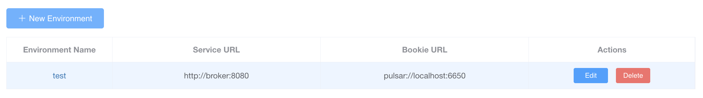

# Pulsar Testbed

Apache Pulsar is a real-time messaging and event streaming platform used to handle stable and scalable data flow in large-scale distributed systems. Pulsar is developed as an Apache Software Foundation project and provides various features for distributed messaging systems and event stream processing.

Pulsar operates based on the Pub-Sub messaging pattern (publish-subscribe). Producers publish messages to topics, and consumers subscribe to these topics to receive messages. This Pub-Sub model is useful for building message-based applications and event-driven architectures.

 

### Getting Started

**`pulsar-manager` URL Information**

- Service URL : `http://broker:8080`
- Bookie URL : `pulsar://localhost:6650`

 

### References

- [Pulsar](https://pulsar.apache.org/) : <https://pulsar.apache.org/>
- [Run a Pulsar cluster locally with Docker Compose](https://pulsar.apache.org/docs/next/getting-started-docker-compose/) : <https://pulsar.apache.org/docs/next/getting-started-docker-compose/>

 

### Appendix

**Difference between Apache Kafka and Apache Pulsar**

